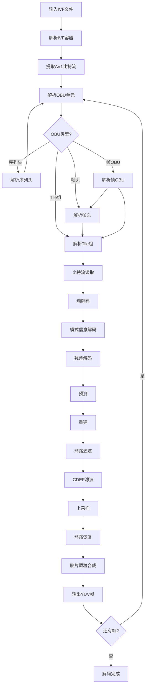

# AV1 解码过程完整文档

本文档详细说明AV1解码器在解码过程中会执行的所有工作，结合源码实现进行说明。

## 目录

1. [解码流程概述](#解码流程概述)
2. [阶段一：容器格式解析](#阶段一容器格式解析)
3. [阶段二：OBU解析](#阶段二obu解析)
4. [阶段三：比特流读取](#阶段三比特流读取)
5. [阶段四：熵解码](#阶段四熵解码)
6. [阶段五：帧头解析](#阶段五帧头解析)
7. [阶段六：Tile解码](#阶段六tile解码)
8. [阶段七：预测](#阶段七预测)
9. [阶段八：重建](#阶段八重建)
10. [阶段九：后处理滤波](#阶段九后处理滤波)
11. [阶段十：输出处理](#阶段十输出处理)
12. [解码流程图](#解码流程图)

---

## 解码流程概述

AV1解码过程是一个多阶段的流水线，从比特流输入到最终视频帧输出，涉及以下主要阶段：

```
容器解析 → OBU解析 → 比特流读取 → 熵解码 → 帧头解析 → 
Tile解码 → 预测 → 重建 → 滤波 → 输出
```

每个阶段都有其特定的职责和实现位置，下面将详细说明。

---

## 阶段一：容器格式解析

### 功能说明

解析视频流的容器格式（如IVF格式），提取AV1比特流数据。

### 源码位置

- **文件**: `src/container/ivf_parser.py`
- **类**: `IVFParser`
- **函数**: `parse_ivf_header()`, `parse_file()`

### 主要工作

1. **解析IVF文件头**
   - 读取文件签名（"DKIF"）
   - 读取版本号
   - 读取编解码器标识（"AV01"）
   - 读取分辨率信息
   - 读取时间基准
   - 读取帧数量

2. **提取帧数据**
   - 读取每帧的时间戳
   - 读取每帧的大小
   - 提取AV1比特流数据

---

## 阶段二：OBU解析

### 功能说明

解析AV1的OBU（Open Bitstream Unit）单元，这是AV1比特流的基本组织单位。

### 源码位置

- **文件**: `src/obu/decoder.py`, `src/obu/obu.py`
- **类**: `AV1Decoder`, `OBUHeaderParser`
- **函数**: `__open_bitstream_unit()`, `__frame_unit()`

### OBU类型

AV1支持多种OBU类型，每种类型有不同的处理方式：

1. **OBU_SEQUENCE_HEADER** - 序列头
   - 包含序列级别的配置信息
   - 解析函数：`sequence_header_obu()`
   - 位置：`src/obu/seq_header.py`

2. **OBU_TEMPORAL_DELIMITER** - 时间分隔符
   - 标记时间层的边界

3. **OBU_FRAME_HEADER** - 帧头
   - 包含帧级别的配置信息
   - 解析函数：`frame_header_obu()`
   - 位置：`src/frame/frame_header.py`

4. **OBU_TILE_GROUP** - Tile组
   - 包含实际的图像数据
   - 解析函数：`tile_group_obu()`
   - 位置：`src/tile/tile_group.py`

5. **OBU_FRAME** - 帧OBU
   - 包含帧头和Tile组
   - 解析函数：`frame_obu()`
   - 位置：`src/frame/frame_header.py`

6. **OBU_METADATA** - 元数据
   - 包含额外的元数据信息
   - 解析函数：`metadata_obu()`
   - 位置：`src/obu/metadata_obu.py`

### 主要工作

1. **解析OBU头**
   - 读取OBU类型
   - 读取OBU扩展标志
   - 读取OBU大小
   - 读取时间ID和空间ID（如果存在）

2. **根据OBU类型分发处理**
   - 调用相应的解析函数
   - 更新解码器状态

## 阶段三：比特流读取

### 功能说明

实现比特流的底层读取操作，包括位读取、字节对齐等。

### 源码位置

- **文件**: `src/bitstream/bit_reader.py`, `src/bitstream/descriptors.py`
- **类**: `BitReader`
- **函数**: `read_bits()`, `read_literal()`, `read_f()`, `read_leb128()`

### 主要工作

1. **位级读取**
   - 读取指定位数的数据
   - 处理字节边界对齐
   - 维护读取位置

2. **描述符读取**
   - `read_f()`: 有限符号集读取
   - `read_leb128()`: LEB128变长编码读取
   - `read_uvlc()`: UVLC变长编码读取
   - `read_su()`: 有符号整数读取
   - `read_ns()`: 非对称有符号整数读取

---

## 阶段四：熵解码

### 功能说明

实现AV1的熵解码（符号解码），将压缩的符号数据解码为实际的语法元素值。

### 源码位置

- **文件**: `src/entropy/symbol_decoder.py`, `src/entropy/cdf_selection.py`, `src/entropy/default_cdfs.py`
- **类**: `SymbolDecoder`
- **函数**: `read_symbol()`, `inverseCdf()`

### 主要工作

1. **符号解码**
   - 使用CDF（累积分布函数）进行符号解码
   - 实现规范文档中的 `read_symbol()` 函数
   - 处理自适应CDF更新

2. **CDF管理**
   - 加载默认CDF
   - 更新CDF（根据解码的符号）
   - 保存CDF（用于参考帧）

3. **上下文建模**
   - 根据上下文选择CDF
   - 实现各种语法元素的CDF选择函数

### 支持的语法元素

- 块划分模式（partition）
- 预测模式（intra_mode, inter_mode）
- 运动向量（mv_joint, mv_class, mv_fr, mv_hp）
- 变换信息（tx_size, tx_type）
- 残差系数（coeff_base, coeff_br, eob_pt）
- 量化参数（delta_q）
- 等等...

---

## 阶段五：帧头解析

### 功能说明

解析帧头（Frame Header），包含帧级别的配置信息和参数。

### 源码位置

- **文件**: `src/frame/frame_header.py`
- **类**: `FrameHeaderParser`, `FrameHeader`
- **函数**: `frame_header_obu()`, `frame_obu()`

### 主要工作

1. **解析帧头语法**
   - 帧类型（KEY_FRAME, INTER_FRAME等）
   - 显示标志（show_frame, show_existing_frame）
   - 帧尺寸和裁剪信息
   - 参考帧索引
   - 量化参数
   - 环路滤波参数
   - CDEF参数
   - 环路恢复参数
   - 分割参数
   - 胶片颗粒参数

2. **设置帧级状态**
   - 更新解码器状态
   - 设置参考帧列表
   - 初始化Tile组

## 阶段六：Tile解码

### 功能说明

Tile是AV1并行解码的基本单元。Tile解码包括模式信息解码和残差解码。

### 源码位置

- **文件**: `src/tile/tile_group.py`
- **类**: `TileGroupParser`, `TileGroup`
- **函数**: `tile_group_obu()`

### 主要工作

#### 6.1 模式信息解码

1. **块划分解码**
   - 解码块的划分模式（PARTITION_NONE, PARTITION_HORZ等）
   - 递归处理子块

2. **预测模式解码**
   - 帧内预测模式（Y_MODE, UV_MODE）
   - 帧间预测模式（参考帧、运动向量）
   - 跳过模式
   - 复合预测模式

3. **变换信息解码**
   - 变换尺寸（TX_SIZE）
   - 变换类型（TX_TYPE）

4. **运动向量解码**
   - 运动向量联合（mv_joint）
   - 运动向量类别（mv_class）
   - 运动向量分数部分（mv_fr）
   - 运动向量高精度部分（mv_hp）

#### 6.2 残差解码

1. **残差语法解码**
   - 解码残差标志
   - 确定变换块尺寸

2. **变换树解码**
   - 递归解码变换树结构
   - 处理子块划分

3. **变换块解码**
   - 解码每个变换块的系数
   - 处理DC和AC系数

4. **系数解码**
   - 解码系数基值（coeff_base）
   - 解码系数符号（dc_sign）
   - 解码系数尾数（coeff_br）
   - 解码EOB位置（eob_pt）

## 阶段七：预测

### 功能说明

根据解码的模式信息，生成预测块。支持多种预测模式。

### 源码位置

- **文件**: `src/reconstruction/prediction.py`
- **类**: `Prediction`
- **函数**: `predict_intra()`, `predict_inter()`, `predict_palette()`, `predict_chroma_from_luma()`

### 主要工作

1. **帧内预测（Intra Prediction）**
   - 方向预测模式（8个方向）
   - DC预测模式
   - 平滑预测模式（SMOOTH, SMOOTH_H, SMOOTH_V）
   - 滤波器内预测（FILTER_INTRA）

2. **帧间预测（Inter Prediction）**
   - 单参考帧预测
   - 复合预测（COMPOUND）
   - 扭曲运动（WARPED_MOTION）
   - 全局运动（GLOBAL_MOTION）
   - 帧内块复制（IntraBC）

3. **调色板预测（Palette Prediction）**
   - 颜色索引预测

4. **色度从亮度预测（Chroma from Luma, CfL）**
   - 基于亮度信息的色度预测

## 阶段八：重建

### 功能说明

将预测块和残差块结合，通过反量化、反变换等操作重建图像块。

### 源码位置

- **文件**: `src/reconstruction/reconstruct.py`
- **类**: `InverseTransform`
- **函数**: `reconstruct_process()`, `inverse_2d_transform_process()`

### 主要工作

1. **反量化（Dequantization）**
   - 根据量化参数对系数进行反量化
   - 处理DC和AC系数

2. **反变换（Inverse Transform）**
   - 2D反变换（DCT, ADST, FLIPADST等）
   - 支持多种变换类型和尺寸
   - 处理矩形块

3. **重建块**
   - 将预测块和残差块相加
   - 裁剪到有效范围
   - 存储到当前帧缓冲区

## 阶段九：后处理滤波

### 功能说明

对重建后的帧进行后处理滤波，提高视觉质量。

### 源码位置

- **文件**: `src/frame/decoding_process.py`
- **函数**: `loop_filter_process()`, `cdef_process()`, `loop_restoration_process()`, `upscaling_process()`

### 主要工作

#### 9.1 环路滤波（Loop Filter）

- **文件**: `src/frame/loop_filter.py`
- **类**: `LoopFilter`
- **功能**: 
  - 去块效应滤波
  - 水平和垂直边缘滤波
  - 根据块边界强度调整滤波强度

#### 9.2 CDEF（Constrained Directional Enhancement Filter）

- **文件**: `src/frame/cdef.py`
- **类**: `CdefProcess`
- **功能**:
  - 方向性增强滤波
  - 减少振铃伪影
  - 提高图像清晰度

#### 9.3 上采样（Upscaling）

- **功能**: 
  - 如果使用超分辨率，对帧进行上采样
  - 使用插值滤波器

#### 9.4 环路恢复（Loop Restoration）

- **文件**: `src/frame/loop_restoration.py`
- **类**: `LoopRestoration`
- **功能**:
  - Wiener滤波
  - SGRPROJ（Self-Guided Restoration）滤波
  - 进一步减少伪影

### 处理顺序

```
重建帧 → Loop Filter → CDEF → 上采样 → Loop Restoration → 最终帧
```

## 阶段十：输出处理

### 功能说明

生成最终输出帧，包括胶片颗粒合成等后处理。

### 源码位置

- **文件**: `src/frame/output_process.py`, `src/frame/decoding_process.py`
- **类**: `FilmGrainSynthesisProcess`
- **函数**: `output_process()`

### 主要工作

1. **中间输出准备**
   - 准备输出帧缓冲区
   - 处理色度子采样

2. **胶片颗粒合成（Film Grain Synthesis）**
   - 如果启用，合成胶片颗粒效果
   - 根据胶片颗粒参数生成噪声
   - 添加到输出帧

3. **参考帧更新**
   - 更新参考帧存储
   - 保存CDF、滤波参数等状态

4. **输出最终帧**
   - 将处理后的帧输出到YUV缓冲区
   - 更新显示状态

## 解码流程图

### 整体流程图



### 详细解码流程图

```mermaid
graph TB
    subgraph "容器层"
        A1[IVF文件] --> A2[IVF解析器]
        A2 --> A3[提取帧数据]
    end
    
    subgraph "OBU解析层"
        A3 --> B1[OBU头解析]
        B1 --> B2{OBU类型}
        B2 -->|序列头| B3[序列头解析<br/>Sequence Header]
        B2 -->|帧头| B4[帧头解析<br/>Frame Header]
        B2 -->|Tile组| B5[Tile组解析]
        B2 -->|帧OBU| B6[帧OBU解析]
        B6 --> B4
        B6 --> B5
        B3 --> B7[解析序列参数<br/>分辨率/颜色配置等]
        B4 --> B8[解析帧类型<br/>frame_type]
        B8 --> B9{帧类型判断}
    end
    
    subgraph "帧头处理"
        B9 -->|KEY_FRAME| C1[关键帧处理]
        B9 -->|INTER_FRAME| C2[非关键帧处理]
        C1 --> C3[设置参考帧列表<br/>set_frame_refs]
        C2 --> C3
        C3 --> C4[运动场估计<br/>motion_field_estimation]
    end
    
    subgraph "比特流层"
        B5 --> D1[读取位/字节]
    end
    
    subgraph "熵解码层"
        D1 --> E1[符号解码器<br/>SymbolDecoder]
        E1 --> E2[CDF选择<br/>根据上下文]
        E2 --> E3[符号解码<br/>read_symbol]
        E3 --> E4[CDF更新<br/>自适应更新]
    end
    
    subgraph "Tile解码层 - 关键帧路径"
        B5 --> F0{帧类型}
        F0 -->|KEY_FRAME| F1[遍历Superblock]
        F1 --> F2[解码块划分<br/>partition]
        F2 --> FE{划分模式}
        FE -->|PARTITION_NONE| FF[解码单个块]
        FE -->|PARTITION_SPLIT| FG[递归处理子块]
        FE -->|其他| FH[解码相应划分]
        FF --> F3[解码预测模式<br/>仅帧内模式<br/>is_inter=0]
        FG --> F3
        FH --> F3
        F3 --> F4[解码调色板语法<br/>palette_tokens<br/>PaletteSizeY/UV]
        F4 --> F5[解码变换信息<br/>read_block_tx_size]
        F5 --> F6[残差解码<br/>residual]
        F6 --> F7[遍历变换块<br/>无变换树]
        F7 --> F8{调色板模式?}
        F8 -->|是| F9[调色板预测<br/>predict_palette]
        F8 -->|否| F10[帧内预测<br/>predict_intra]
        F9 --> F11[解码系数<br/>coeffs]
        F10 --> F11
        F11 --> F12{有残差?}
        F12 -->|是| F13[重建块<br/>reconstruct]
        F12 -->|否| F14[标记已解码]
        F13 --> F14
    end
    
    subgraph "Tile解码层 - 非关键帧路径"
        F0 -->|INTER_FRAME| G1[遍历Superblock]
        G1 --> G2[解码块划分<br/>partition]
        G2 --> GE{划分模式}
        GE -->|PARTITION_NONE| GF[解码单个块]
        GE -->|PARTITION_SPLIT| GG[递归处理子块]
        GE -->|其他| GH[解码相应划分]
        GF --> G3[解码is_inter标志]
        GG --> G3
        GH --> G3
        G3 --> G4{预测类型}
        G4 -->|帧内| G5[解码帧内模式]
        G4 -->|帧间| G6[解码参考帧索引<br/>read_ref_frames]
        G6 --> G7[查找MV栈<br/>find_mv_stack<br/>构建MV候选]
        G7 --> G8[解码运动向量<br/>MV]
        G8 --> G9[解码复合预测信息<br/>read_compound_type]
        G5 --> G10[解码调色板语法<br/>palette_tokens<br/>PaletteSizeY/UV]
        G9 --> G10
        G10 --> G11[解码变换信息<br/>read_block_tx_size]
        G11 --> G12[计算预测<br/>compute_prediction]
        G12 --> G13{Inter-Intra?}
        G13 -->|是| G14[帧内预测]
        G13 -->|否| G15{帧间模式?}
        G14 --> G15
        G15 -->|是| G16[帧间预测]
        G15 -->|否| G17[残差解码<br/>residual]
        G16 --> G17
        G17 --> G18{帧间块且非无损?}
        G18 -->|是| G19[解码变换树<br/>transform_tree]
        G18 -->|否| G20[遍历变换块]
        G19 --> G21[递归处理子块]
        G21 --> G22
        G20 --> G22[解码变换块<br/>transform_block]
        G22 --> G23{帧内块?}
        G23 -->|是| G24{调色板模式?<br/>PaletteSizeY/UV}
        G23 -->|否| G25[使用已计算的预测]
        G24 -->|是| G26[调色板预测<br/>predict_palette]
        G24 -->|否| G27[帧内预测<br/>predict_intra]
        G26 --> G28[解码系数<br/>coeffs]
        G27 --> G28
        G25 --> G28
        G28 --> G29{有残差?}
        G29 -->|是| G30[重建块<br/>reconstruct]
        G29 -->|否| G31[标记已解码]
        G30 --> G31
    end
    
    subgraph "重建层"
        F13 --> H1[反量化<br/>Dequantization]
        G30 --> H1
        H1 --> H2[反变换<br/>Inverse Transform]
        H2 --> H3[预测+残差]
        H3 --> H4[重建块<br/>CurrFrame]
    end
    
    subgraph "后处理层"
        F14 --> I1{show_existing_frame?}
        G31 --> I1
        I1 -->|0| I2[环路滤波<br/>Loop Filter]
        I1 -->|1| I3{关键帧?}
        I3 -->|是| I4[加载参考帧<br/>reference_frame_loading]
        I3 -->|否| I5[跳过后处理]
        I2 --> I6[CDEF滤波]
        I6 --> I7[上采样<br/>Upscaling]
        I7 --> I8[环路恢复<br/>Loop Restoration]
        I8 --> I9[运动场MV存储<br/>motion_field_motion_vector_storage]
        I9 --> I10[参考帧更新<br/>reference_frame_update]
        I4 --> I10
        I5 --> I10
    end
    
    subgraph "输出层"
        I10 --> J1{show_frame?}
        J1 -->|是| J2[胶片颗粒合成<br/>Film Grain Synthesis]
        J1 -->|否| J3[跳过输出]
        J2 --> J4[输出YUV帧]
        J3 --> J5[帧结束更新CDF<br/>frame_end_update_cdf]
        J4 --> J5
        J5 --> J6[解码完成]
    end
    
    style A1 fill:#e1f5ff
    style B2 fill:#fff9c4
    style B9 fill:#fff9c4
    style C1 fill:#c8e6c9
    style C2 fill:#ffccbc
    style E1 fill:#f3e5f5
    style F1 fill:#e8f5e9
    style G1 fill:#fff3e0
    style H4 fill:#fff3e0
    style J6 fill:#c8e6c9
```



## 关键数据结构

### AV1Decoder

解码器主类，管理长期状态：

- `seq_header`: 序列头
- `frame_header`: 帧头
- `tile_group`: Tile组
- `ref_frame_store`: 参考帧存储
- `decoder`: 符号解码器
- `CurrFrame`: 当前帧
- `LrFrame`: 环路恢复后的帧

### TileGroup

Tile组数据结构，包含：

- `MiRow`, `MiCol`, `MiSize`: 当前块位置和尺寸
- `partition`: 划分模式
- `RefFrame`: 参考帧
- `Mvs`: 运动向量
- `SegmentIds`: 分割ID
- `Coeffs`: 系数
- `BlockDecoded`: 块解码标志

### FrameHeader

帧头数据结构，包含：

- `frame_type`: 帧类型
- `show_frame`: 显示标志
- `quantization_params`: 量化参数
- `loop_filter_params`: 环路滤波参数
- `cdef_params`: CDEF参数
- `lr_params`: 环路恢复参数

---

## 总结

AV1解码过程是一个复杂的多阶段流水线，涉及：

1. **解析阶段**: 容器、OBU、帧头解析
2. **解码阶段**: 熵解码、模式信息解码、残差解码
3. **重建阶段**: 预测、反量化、反变换、重建
4. **后处理阶段**: 环路滤波、CDEF、上采样、环路恢复
5. **输出阶段**: 胶片颗粒合成、参考帧更新、输出

每个阶段都有明确的职责和实现位置，整个流程严格按照AV1规范文档实现，确保了解码的正确性和兼容性。

---

**文档生成时间**: 2024年  
**基于源码**: `src/` 目录下的AV1解码器实现  
**参考规范**: AV1规范文档

